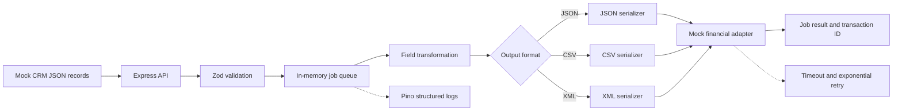

# Node.js TypeScript Integration Demo

A sanitized portfolio repository that demonstrates the engineering patterns used in production system integrations without exposing client code, credentials, schemas, or proprietary business rules.

The fictional flow is:

```text
Mock CRM
  -> Node.js / TypeScript REST API
  -> Zod validation
  -> field transformation
  -> in-memory background queue
  -> JSON / CSV / XML serialization
  -> mock financial system
  -> structured logs, timeouts, retries, and status tracking
```

> All organizations, people, identifiers, records, endpoints, and rules in this repository are synthetic.

## What this project demonstrates

- Node.js 20+ and strict TypeScript
- Express REST endpoints
- Zod input and contract validation
- JSON, CSV, and XML transformations
- Background job processing
- Exponential retry logic
- Downstream timeouts
- Structured logging with Pino
- Consistent API error responses
- Unit and API tests with Vitest and Supertest
- Multi-stage Docker build
- GitHub Actions CI
- Graceful shutdown
- Environment-based configuration

## Architecture



## Repository structure

```text
src/
  adapters/       Fictional CRM and financial-system clients
  config/         Environment parsing and validation
  queue/          In-memory background job queue
  routes/         Express API routes
  schemas/        Zod source and target contracts
  serializers/    JSON, CSV, and XML serialization
  services/       Mapping and orchestration logic
  utils/          Logging, retries, timeouts, and errors
tests/            Unit and API tests
src/data/         Synthetic CRM records
.github/workflows GitHub Actions CI
```

## Quick start

### Prerequisites

- Node.js 20 or newer
- npm 10 or newer

### Run locally

```bash
cp .env.example .env
npm install
npm run dev
```

The API starts at `http://localhost:3000`.

### Verify the repository

```bash
npm run check
```

This runs linting, tests, and the TypeScript build.

## API endpoints

| Method | Endpoint | Purpose |
|---|---|---|
| `GET` | `/health` | Service health |
| `GET` | `/api/mock-crm/students` | List synthetic CRM records |
| `GET` | `/api/mock-crm/students/:studentId` | Read one synthetic CRM record |
| `POST` | `/api/transform` | Validate, map, and serialize an inline record |
| `POST` | `/api/integrations/sync` | Queue a CRM-to-financial-system integration |
| `GET` | `/api/jobs` | List integration jobs |
| `GET` | `/api/jobs/:jobId` | Read job status and result |

## Example: queue an integration

```bash
curl -X POST http://localhost:3000/api/integrations/sync \
  -H "Content-Type: application/json" \
  -H "X-Request-Id: portfolio-demo-001" \
  -d '{
    "crmStudentId": "crm-1001",
    "outputFormat": "xml"
  }'
```

Example accepted response:

```json
{
  "message": "Integration job accepted",
  "jobId": "3f6f9ee5-0000-4000-8000-000000000000",
  "status": "queued",
  "statusUrl": "/api/jobs/3f6f9ee5-0000-4000-8000-000000000000"
}
```

Then query the job:

```bash
curl http://localhost:3000/api/jobs/YOUR_JOB_ID
```

## Example: transform an inline record

```bash
curl -X POST http://localhost:3000/api/transform \
  -H "Content-Type: application/json" \
  -d '{
    "outputFormat": "csv",
    "student": {
      "id": "crm-demo-9",
      "firstName": "Taylor",
      "lastName": "Rivera",
      "email": "taylor.rivera@example.test",
      "dateOfBirth": "2000-08-12",
      "status": "active",
      "address": {
        "line1": "9 Portfolio Way",
        "city": "Northbridge",
        "region": "MA",
        "postalCode": "02110",
        "country": "US"
      },
      "enrollment": {
        "programCode": "MS-DS",
        "startTerm": "2026-FA",
        "creditLoad": 9
      },
      "updatedAt": "2026-07-01T12:00:00.000Z"
    }
  }'
```

## Reliability patterns

### Validation at system boundaries

The mock CRM record is validated before mapping, and the transformed financial-system record is validated again before delivery. This prevents invalid assumptions from crossing integration boundaries.

### Timeouts

Each external-adapter operation is wrapped in a timeout so a slow dependency cannot hold a worker indefinitely.

### Retries

Transient adapter failures use bounded exponential backoff. The maximum attempts and base delay are configured with environment variables.

### Idempotency in a real implementation

A production version would add a persistent queue and idempotency key such as:

```text
source-system + entity-id + source-updated-at + target-system
```

The target adapter would store or verify that key before applying a write.

### Structured logs

Logs include request IDs, job IDs, student IDs, operation names, attempt counts, and downstream transaction IDs. Sensitive fields such as email addresses and birth dates are redacted by the logger configuration.

## Simulating downstream failures

Set a failure probability between `0` and `1`:

```bash
MOCK_FINANCIAL_FAILURE_RATE=0.5 npm run dev
```

This allows the retry and failed-job paths to be demonstrated without a real dependency.

## Docker

```bash
docker compose up --build
```

Or build and run directly:

```bash
docker build -t node-typescript-integration-demo .
docker run --rm -p 3000:3000 node-typescript-integration-demo
```

## GitHub Actions

The CI workflow runs on pushes to `main` and on pull requests. It:

1. installs dependencies with `npm ci`;
2. runs ESLint;
3. runs the Vitest suite;
4. compiles TypeScript;
5. builds the Docker image.

## Production evolution

For a real deployment, the in-memory queue would be replaced with a durable queue such as SQS, RabbitMQ, or Redis-backed BullMQ. The synthetic JSON source would become an authenticated API or SFTP connector, secrets would be stored in a managed secret service, and job state would be persisted in a database.

## Portfolio safety checklist

Before adapting this repository, keep it sanitized:

- Do not copy client source code.
- Do not reuse real field names when they are proprietary.
- Do not include production URLs, credentials, certificates, or IP addresses.
- Do not include real student, customer, employee, or financial data.
- Replace client-specific rules with fictional examples.
- Keep commit history free of secrets.

## License

MIT
