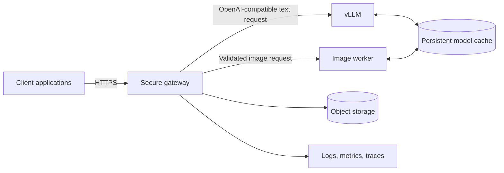

# Architecture and Trust Boundaries

## System objective

The platform provides application teams with controlled access to self-hosted generative AI. It separates public application traffic from GPU inference infrastructure and supports different inference engines behind one gateway.

The editable source is available in [`docs/diagrams/architecture.mmd`](diagrams/architecture.mmd).

## Components

### Client applications

Web, mobile, or internal applications use a public model alias and a gateway-issued credential. They do not receive RunPod credentials or direct inference-service URLs.

### Secure application gateway

The gateway is the policy enforcement point. Its responsibilities include:

- client authentication and tenant authorization;
- request validation and parameter bounds;
- public-to-private model mapping;
- rate and budget controls;
- content-policy extension points;
- upstream authentication;
- request timeout and cancellation;
- error normalization;
- audit metadata and observability.

### vLLM text inference

vLLM loads an approved open-weight text model and exposes compatible endpoints such as `/v1/chat/completions`. The service is treated as a private infrastructure component, even when its own API-key option is enabled.

### Image-generation worker

Image generation is isolated from vLLM because the runtime, memory profile, model pipeline, and response handling differ from text inference. The worker can expose a small internal API around a diffusion pipeline or a workflow engine.

### Persistent storage

Model weights and caches should be placed on storage that survives Pod replacement when startup time matters. Generated assets belong in purpose-built object storage rather than relying on a GPU Pod as the long-term system of record.

## Trust boundaries

### Boundary 1: public internet to gateway

Only the gateway is intended to accept public inference traffic. TLS termination, WAF controls, authentication, rate limiting, and request-size limits are applied here.

### Boundary 2: gateway to inference network

The gateway communicates with vLLM and image workers through private networking when available. Each upstream still requires authentication; private networking is not a substitute for service identity.

### Boundary 3: runtime to secret store

Credentials are injected at runtime. They are never embedded in a container image, committed to Git, printed in startup logs, or returned in client errors.

### Boundary 4: inference to persistent data

Model files, caches, generated assets, logs, and user data have different retention and access requirements. They should not be stored in one undifferentiated volume.

## Failure domains

Text and image services are separate failure domains. A failed image worker should not make text generation unavailable. Readiness reports both dependencies, while route-level handling returns a specific normalized error for the unavailable service.
