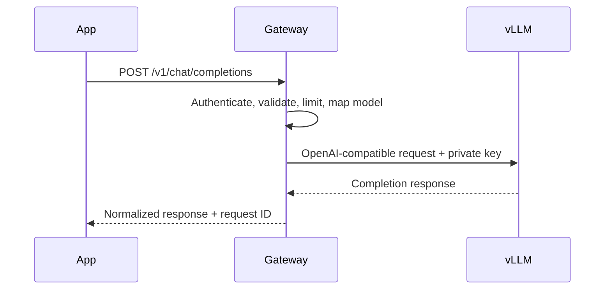
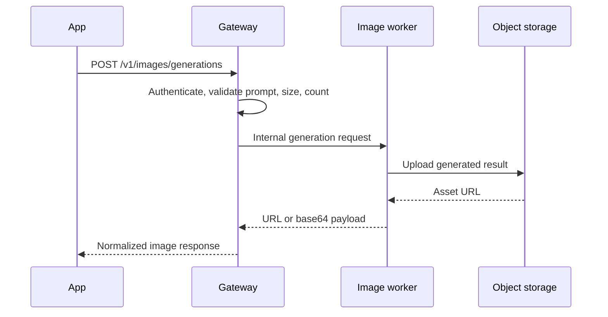

# Text and Image Workflows

## Text-generation workflow



### Request example

```json
{
  "model": "portfolio-text-model",
  "messages": [
    { "role": "system", "content": "Answer clearly and concisely." },
    { "role": "user", "content": "Explain the purpose of a secure AI gateway." }
  ],
  "temperature": 0.3,
  "max_tokens": 300
}
```

The gateway replaces the public model alias with the private vLLM model identifier before forwarding the request.

## Image-generation workflow



### Request example

```json
{
  "prompt": "A calm abstract landscape for a meditation application",
  "size": "1024x1024",
  "n": 1,
  "response_format": "url"
}
```

### Why it is separate from vLLM

Text and image generation differ in model architecture, dependencies, memory behavior, execution time, queuing needs, and output storage. The gateway unifies client access without incorrectly treating both workloads as one model server.

## Synchronous versus asynchronous images

The sample uses a synchronous endpoint for clarity. Production image workloads often benefit from:

1. accepting a job and returning `202 Accepted`;
2. storing job state in a durable queue;
3. processing with bounded GPU concurrency;
4. uploading results to object storage;
5. notifying the application or allowing status polling;
6. expiring temporary assets according to retention policy.
